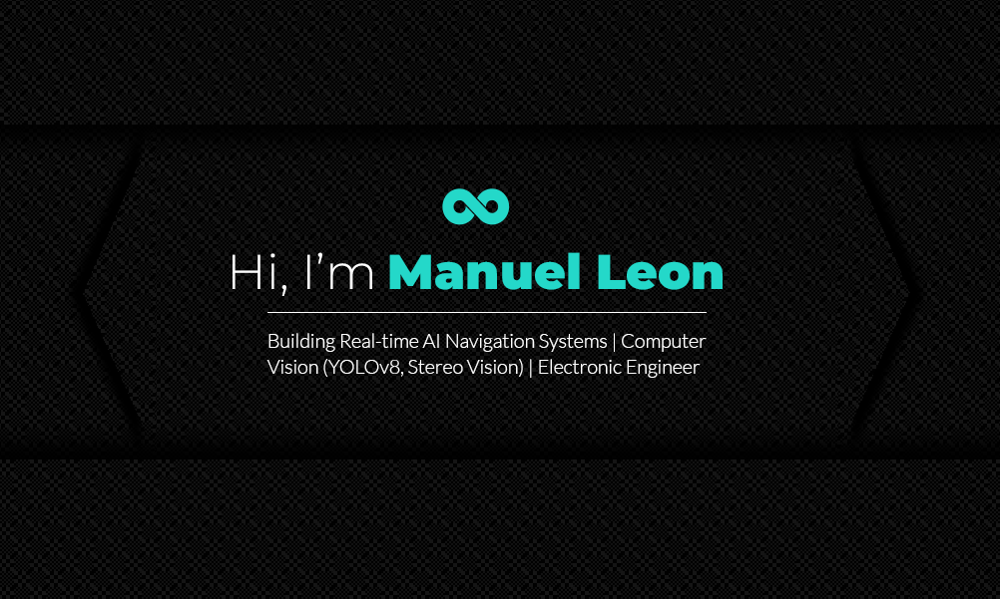

Electronic Engineer with strong expertise in Python and Computer Vision.
Experienced in building real-time systems using YOLOv8, stereo vision and CUDA optimization.
Interested in AI applied to real-world environments and embedded systems.
# Skills
##  AI & Computer Vision

##  Backend APIs

##  Embedded Systems

##  Electronics & Hardware

-FF8F00?style=for-the-badge)

##  Web Development

##   Game Dev

##  Tools System

